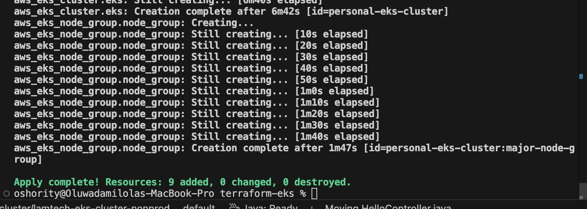
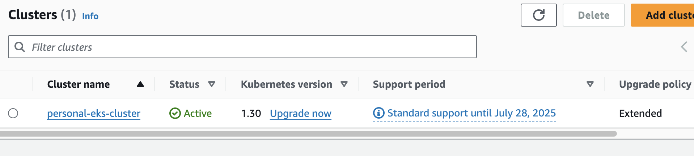
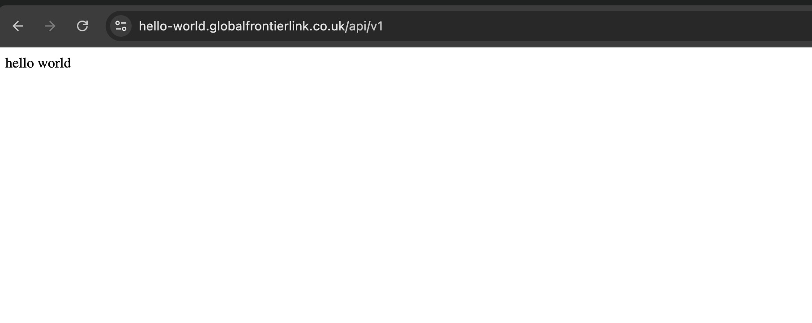
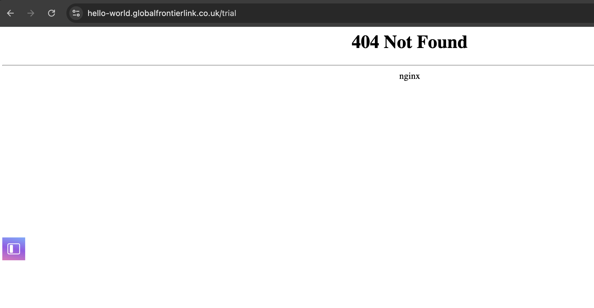
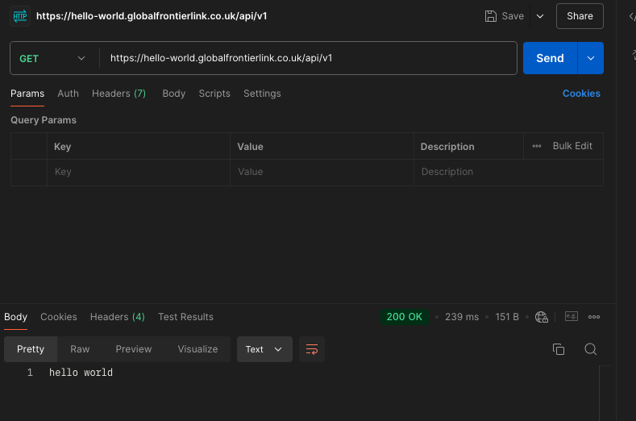
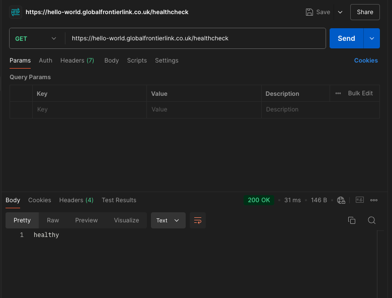
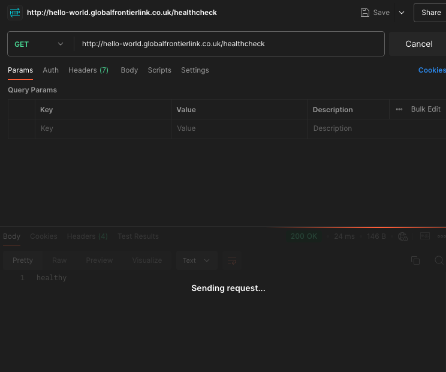
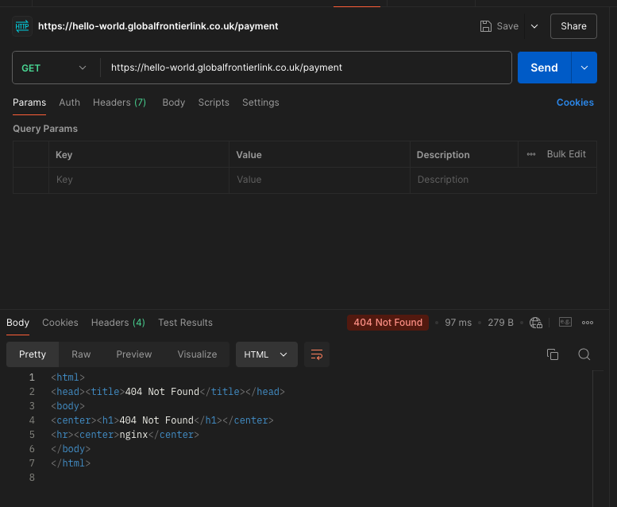

# Hello-World Microservice Application

This project is a simple "Hello World" Application  built with Spring Boot and deployed on Amazon EKS using Helm for deployment. It supports TLS and blocks plain HTTP calls using an Nginx Ingress Controller 

# Please note : It is intentional to BUILD and RUN the application and DOCKERIZE the application  and DEPLOY WITH HELM to show the full understanding of the  SDLC lifecycle .


# HOST URL 
For this tasks , we would be using the following host URL: 


```
hello-world.globalfrontierlink.co.uk/
```

This is an actual domain name that is used for personal project and would shed more  insights when its deployed .


# Pre-requisites

* VS Code

* Java 17

* Maven

* Docker

* AWS CLI

* Amazon EKS

* Helm

* Nginx Ingress Controller

* Amazon ECR

*  Amazon Certificate Manager (ACM)

* Network Load Balancer (NLB)

* Postman


#  <ins>Built with</ins>

* Apache Maven 3.9.9  - Dependency Management

* JAVA 17 -  0pen jdk version "17.0.12

* Spring Boot 3.3.4 - Framework to ease the bootstrapping and development of new Spring Applications

# Step 1: Set up VS Code for the Java Project

Install the Java Extensions and Configure VS Code

* Java Extension Pack - This pack contains everything you need for Java development in VS Code, including Maven, debugging, and testing tools.

* Spring Boot Extension Pack - Helps with Spring Boot development

* Open the Command Palette (Ctrl+Shift+P) and type Java: 
Configure Java Runtime to set your preferred JDK Java 17
Verify your JDK installation by running
```
java -version

```

# Step 2: Create a New Spring Boot Project

* Using Spring Initializr (within VS Code): Create the project and  VS Code will prompt you to open it in the workspace.

# Step 3: Create the HelloController.java
Navigate to the src/main/java/com/example/helloWorld  and create a controller directory in your project and create a new Java class named HelloController.java in the controller  directory.
Add the following code to create a simple "Hello, World!" REST controller:

```java
package com.example.helloworld.controller;

import org.springframework.http.ResponseEntity;
import org.springframework.web.bind.annotation.GetMapping;
import org.springframework.web.bind.annotation.RestController;

@RestController
public class HelloController {

    @GetMapping("/api/v1")
    public ResponseEntity<String> helloWorld() {
        return ResponseEntity.ok("hello world");
    }

    @GetMapping("/healthcheck")
    public ResponseEntity<String> healthCheck() {
        return ResponseEntity.ok("healthy");
    }
}

```


# Step 4: Review the Main Application Class

```java
package com.example.helloworld;

import org.springframework.boot.SpringApplication;
import org.springframework.boot.autoconfigure.SpringBootApplication;

@SpringBootApplication
public class HelloworldApplication {

	public static void main(String[] args) {
		SpringApplication.run(HelloworldApplication.class, args);
	}

}

```


# Step 5: Run the  Spring Boot Application

```
mvn spring-boot:run

```

# Test the connection to give you desired result .
```
curl http://localhost:8080/api/v1

hello world%


curl http://localhost:8080/healthcheck

healthy%

```


# Step 6: Build the application :

Run the following Maven command to clean and package the project into a JAR file:

```
mvn clean package

```
This will create the JAR file in the target/ directory:

```
target/helloworld-0.0.1-SNAPSHOT.jar
```

# Step 7: Run the JAR File
Once the JAR file is created, you can run the application using the java -jar command:

Make sure port 8080 is open and available 

```
java -jar target/helloworld-0.0.1-SNAPSHOT.jar


```

This will start the Spring Boot application on port 8080.


# Step 8: Verify the application

After running the application, you can verify it using curl commands:

To check the "Hello, World!" response 

```
curl http://localhost:8080/api/v1

hello world%


```

To check the health check endpoint:

```
curl http://localhost:8080/healthcheck

healthy%

```


# Step 9 : Dockerize the Spring Boot Application and Pushing to ECR 

### Step 1: Create a Dockerfile

Create a `Dockerfile` in the root of your Spring Boot project. Below is a simple Dockerfile:

```Dockerfile

# Use a lightweight base image with OpenJDK
FROM openjdk:17-jdk-slim

# Set the working directory in the container
WORKDIR /app

# Copy the JAR file into the container
COPY target/helloworld-0.0.1-SNAPSHOT.jar app.jar

# Expose the application port (default is 8080)
EXPOSE 8080

# Command to run the application
ENTRYPOINT ["java", "-jar", "app.jar"]

```


### Step 2: Build the Docker Image
Build the Docker image using the following command:

```
docker build -t helloworld-app .
```
This will create a Docker image named helloworld-app from the Dockerfile.

### Step 3: Run the Docker Image
Run the Docker image as a container:

```
docker run -d -p 8080:8080 --name hello-world-container helloworld-app

```

This will start the container and expose port 8080. You can verify it by running:

```
docker ps
You should see the container running 

```

### Step 4: Create an AWS ECR Repository
Before pushing your image to AWS ECR, you need to create a repository:

```
aws ecr create-repository --repository-name personal-demo/hello-world-app

```


### Step 5: Tag the Docker Image for ECR
To push the Docker image to AWS ECR, tag the image with your repository URI:
```
docker tag  helloworld-app   xxxxxxxxxxxx.dkr.ecr.eu-west-2.amazonaws.com/personal-demo/hello-world-app
```

### Step 6: Log In to AWS ECR
Use the AWS CLI to log in to your AWS ECR registry:
```
aws ecr get-login-password --region eu-west-2 | docker login --username AWS --password-stdin  xxxxxxxxxxxx.dkr.ecr.eu-west-2.amazonaws.com

```

Once login succeeds indicating a successful login:

### Step 7: Push and verify the Docker Image to ECR
Now push the Docker image to AWS ECR:
```
docker push xxxxxxxxxxxx.dkr.ecr.eu-west-2.amazonaws.com/personal-demo/hello-world-app

```

Verify  in your AWS Management Console under ECR > Repositories > personal-demo/hello-world-app. 


# Step 10 : Provisioning an EKS Cluster and verifying the cluster 

### Step 1 : Provision Cluster  and view on AWS console





### Step 2: Update kubeconfig to Connect to EKS Cluster

```
aws eks --region eu-west-2 update-kubeconfig --name personal-eks-cluster
```
and see a message 
```
Added new context arn:aws:eks:eu-west-2:123456789012:cluster/personal-eks-cluster to ~/.kube/config

```
Use commands like thos to verify and check cluster 
```
kubectl config view
kubectl cluster-info
kubectl get nodes
kubectl get ns

```

Create and set namespace you would be working on (DEV environment)
```
kubectl create  namspace dev
kubectl config set-context --current --namespace=cma-app-dev

```


# Step 11 : Deploy the Microservice Using Helm

## Step 1: Helm Deployment for Ingress Controller

### 1.1 Create Ingress YAML File
Create the Helm chart for the ingress controller.

```yaml
# Ingress yaml
apiVersion: networking.k8s.io/v1
kind: Ingress
metadata:
  name: {{ .Values.serviceingress }}
  namespace: {{ .Values.devnamespace }}
  labels:
    app.kubernetes.io/name: {{ .Values.serviceingress }}
spec:
  ingressClassName: nginx
  rules:
  - host: {{ .Values.helloworldappbaseURL }}
    http:
      paths:
      - pathType: Prefix
        path: /api/v1
        backend:
          service:
            name: {{ .Values.helloworldservice }}
            port:
              number: 8080   # Ensure proper indentation here

  - host: {{ .Values.helloworldappbaseURL }}
    http:
      paths:
      - pathType: Prefix
        path: /healthcheck
        backend:
          service:
            name: {{ .Values.helloworldservice }}
            port:
              number: 8080   # Ensure proper indentation here as well


```


### 1.2 Deploy Ingress Controller

 Ingress-controller yaml file  (Configured and can be seen in the project)
 
 Specifications :

 ```
 ACM ARN must be  specified 
 proxy-real-ip-cidr
 NLB stated 

 ```


##  Step 2: Helm Deployment for Hello World Application
### 2.1 Create Deployment YAML File
Below is the Deployment.yaml for your Hello World application:


```yaml
# Deployment.yaml
apiVersion: apps/v1
kind: Deployment
metadata:
  name: {{ .Values.helloApplicationName }}
  namespace: {{ .Values.devnamespace }}
spec:
  replicas: {{ .Values.replicaCount }}
  selector:
    matchLabels:
      app: {{ .Values.helloApplicationName }}
  template:
    metadata:
      labels:
        app: {{ .Values.helloApplicationName }}
    spec:
      containers:
      - name: {{ .Values.helloApplicationName }}
        image: "{{ .Values.helloworldimage.name }}:{{ .Values.helloworldimage.tag }}"
        resources: 
          requests: 
            memory: "128Mi"
            cpu: "500m" 
          limits: 
            memory: "128Mi" 
            cpu: "500m"
        ports:
        - containerPort: 8080
        

```

## 2.2 Create Service YAML File
### The Service.yaml for the Hello World application


```yaml

# service.yaml 
apiVersion: v1
kind: Service
metadata:
  name: {{ .Values.helloworldservice }}
  namespace: {{ .Values.devnamespace }}
spec:
  selector:
    app: {{ .Values.helloApplicationName }}
  ports:
  - port: 80
    targetPort: 8080
  type: ClusterIP
      
  
```


## Step 3: Deploy Hello World Application Using Helm
### 3.1 Create the Helm Chart for the Application
You can create a new Helm chart for your application using the following command:

```
helm create helm-hello-world-app
```

### 3.2 Deploy the Application Using Helm in the DEV environment

```
helm install hello-world-release ./helm-hello-world-app --namespace dev

```

Helm Deployment Output
You should see output similar to the following:

```
NAME: hello-world-release
LAST DEPLOYED: Sun Sep 29 01:52:32 2024
NAMESPACE: dev
STATUS: deployed
REVISION: 1
TEST SUITE: None

```


## Step 4 : Deploy Ingress Controller Using Helm
### 4.1 Create the Helm Chart for the Application
You can create a new Helm chart for your application using the following command:

```
helm create helm-ingress-controller-chart
```

### 4.2 Deploy the Application Using Helm in the DEV environment

```
helm install ingress-controller-release  ./ingress-controller-chart 

```

Helm Deployment Output
You should see output similar to the following:

```
NAME: ingress-controller-release

LAST DEPLOYED: Sun Sep 29 01:43:43 2024

NAMESPACE: dev

STATUS: deployed

REVISION: 1

TEST SUITE: None

```


Verify deployment : 

```
helm list 

```

```
NAME                    	NAMESPACE	REVISION	UPDATED                             	STATUS  	CHART                    	APP VERSION
hello-world-release   	dev      	1       	Sun Sep 29 01:52:32 2024  	deployed	helm-hello-world-app-0.1.0	latest
ingress-controller-release	dev      	1       	Sun Sep 29 01:43:43 2024  	deployed	ingress-nginx-3.35.0       	0.49.0

```


## 4.3 Check the pods 


```
kubectl get pods

NAME                               READY   STATUS    RESTARTS   AGE

hello-world-app-55ccf65c87-v5vxp   1/1     Running   0          18s
```

### Please note : You would need to go to AWS Route53 to route traffic to the newly created NETWORK LOAD BALANCER by Nginx ingress controller to the host name 


Perform an nslookup to see if its ready

```

nslookup  hello-world.globalfrontierlink.co.uk

Server:         fe80::7297:41ff:fe50:d9d0%6

Address:        fe80::7297:41ff:fe50:d9d0%6#53

Non-authoritative answer:

Name:   hello-world.globalfrontierlink.co.uk

Address: 3.11.27.126

Name:   hello-world.globalfrontierlink.co.uk

Address: 13.42.238.37

Name:   hello-world.globalfrontierlink.co.uk

Address: 13.42.235.95
```


## 4.4 Accessing the Application

Once the application and ingress are deployed, access the application via the domain specified in the ingress:

```
curl https://<your-domain-name>/api/v1

```
This should return a "Hello World" response.


```
curl https://<your-domain-name>/healthcheck

```
This should return a "Health Check" response.


```
https://hello-world.globalfrontierlink.co.uk/api/v1

```




```

https://hello-world.globalfrontierlink.co.uk/healthcheck

```


```
https://hello-world.globalfrontierlink.co.uk/payment


```




# Step 12 :  Using POSTMAN TO VALIDATE ALL URL












All acceptance fully observed 


# Please note : It is intentional to BUILD and RUN the application and DOCKERIZE the application  and DEPLOY WITH HELM to show the full understanding of the  SDLC lifecycle .